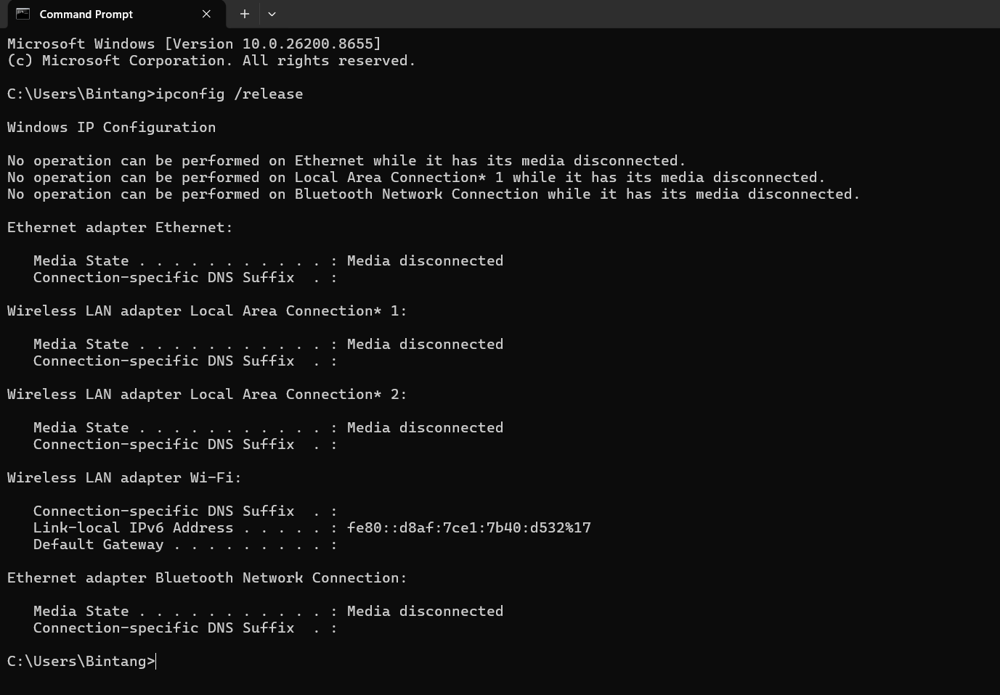
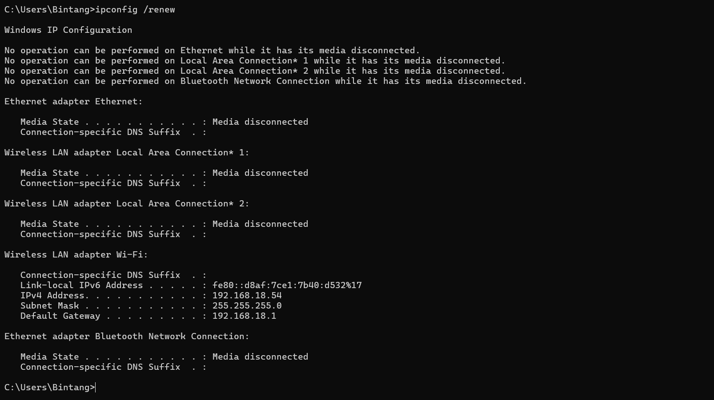
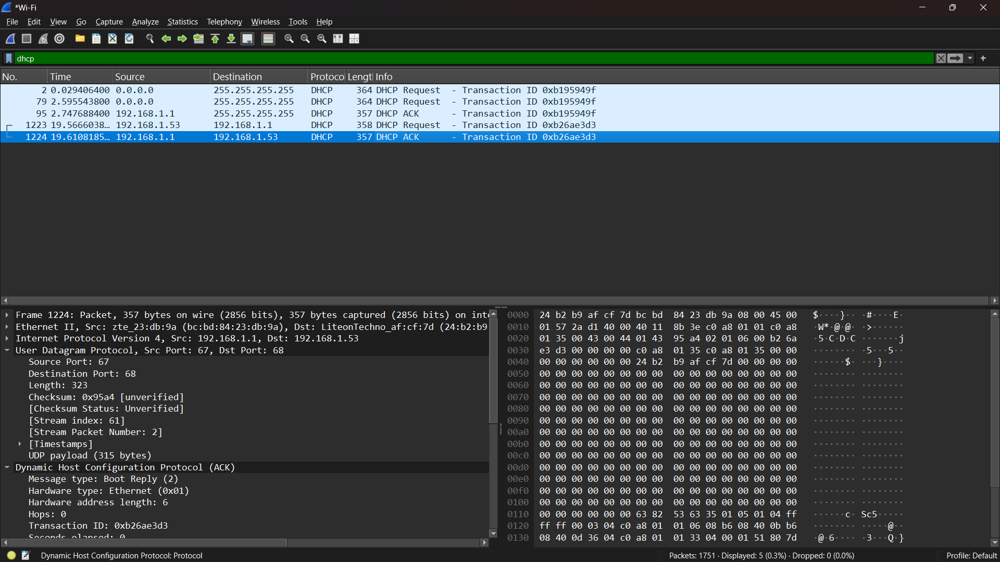

# Laporan Praktikum Jaringan Komputer IF-04-02
NAMA : Bagas Bintang Saputro
NIM  : 103072400078

## Modul 11 DHCP
Tujuan Mahasiswa dapat menginvestigasi cara kerja protokol DHCP menggunakan Wireshark

Di modul ini, kita akan melihat sekilas Dynamic Host Configuration Protocol, DHCP. Ingat bahwa DHCP digunakan secara luas di perusahaan, universitas dan LAN kabel dan nirkabel jaringan rumah untuk secara dinamis menetapkan alamat IP ke host, serta untuk mengkonfigurasi informasi konfigurasi jaringan lainnya. Seperti yang telah kami lakukan di lab Wireshark sebelumnya, Anda akan melakukan beberapa tindakan di komputer Anda yang akan menyebabkan DHCP beraksi, dan kemudian menggunakan Wireshark untuk mengumpulkan dan kemudian jejak paket yang berisi pesan protokol DHCP.

## Mengumpulkan Jejak Paket :
1. IPCONFIG/RELEASE :

2. IPCONFIG/RENEW :

3. DHCP REQUEST :

DHCP ACK :

Pada percobaan DHCP di Windows, paket yang tertangkap hanya DHCP Request dan DHCP ACK. Hal ini terjadi karena sistem masih memiliki lease IP sebelumnya sehingga proses DHCP berlangsung dalam mode renewal, bukan initial discovery penuh.