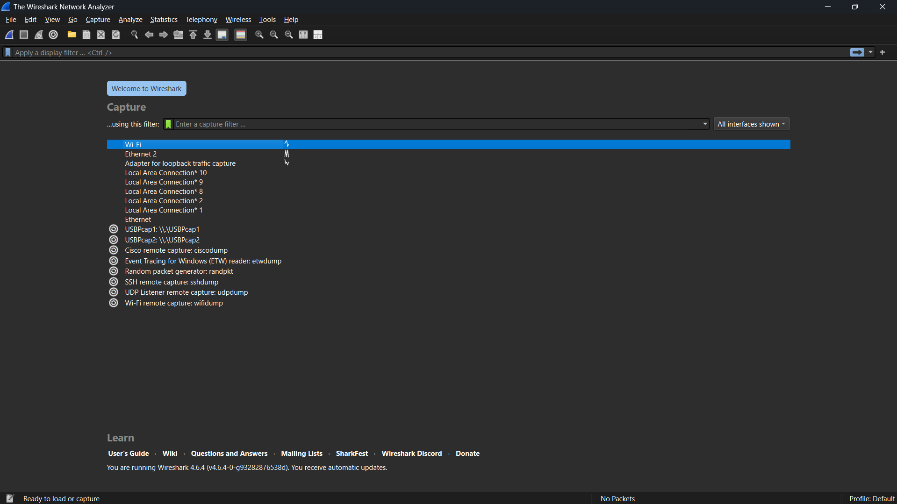
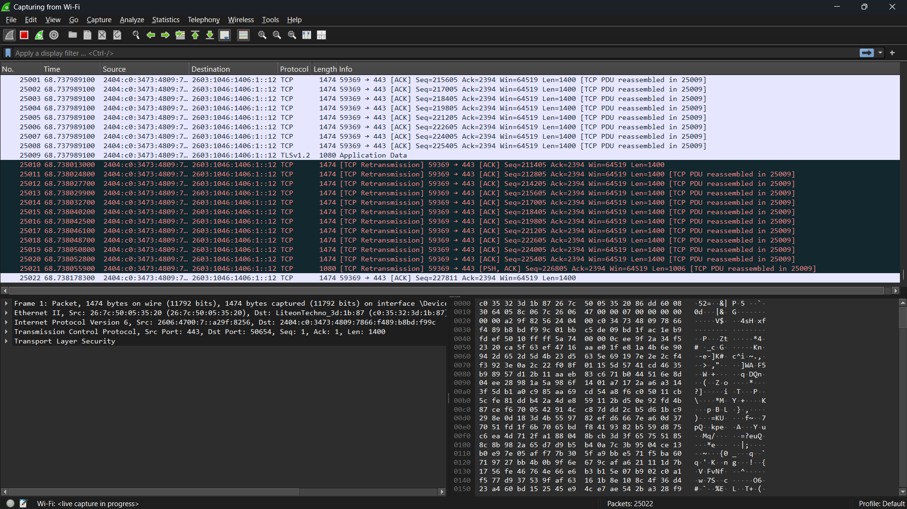
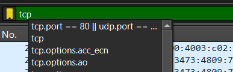
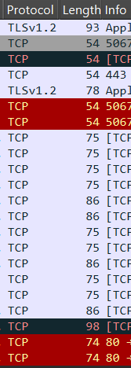
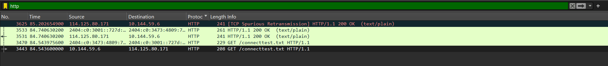
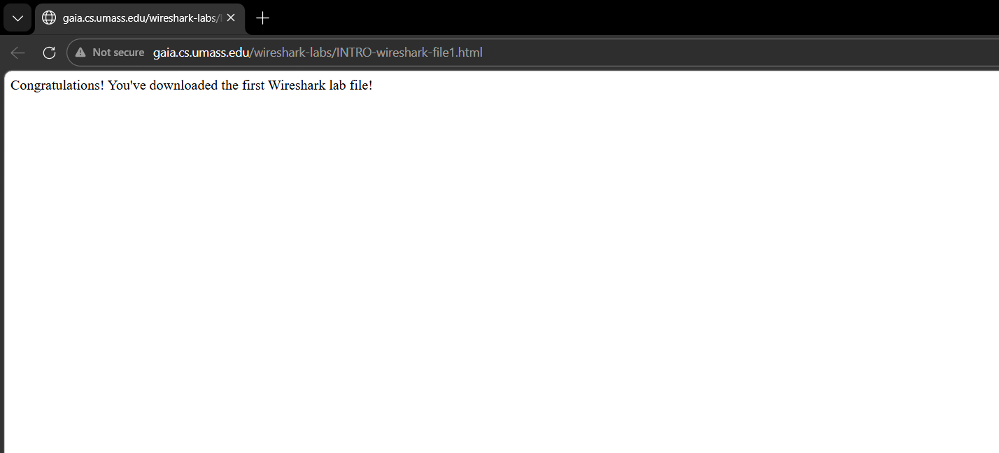
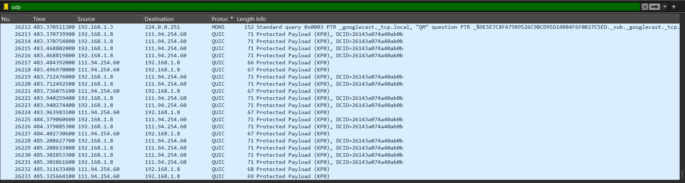

# Laporan praktikum jarkom week 1

## Tujuan praktikum
Menginstall software wireshark dan mempelajari sedikit tentang dasar-dasar atau tools pada software wireshark
## Langkah percobaan
1. Download Software Wireshark di browser masing-masing
2. Setelah selesai download, install software wireshark
3. Jika sudah selesai menginstall, buka Wireshark dan klik bagian wifi (jika menggunakan wifi) 
4. Lalu jika ingin memfilter bagian protocol hanya tcp saja, pencet bagian display filter bar, ketik tcp dan pencet / tekan eter
5. Saat Wireshark sedang berjalan, masukkan URL:http://gaia.cs.umass.edu/wireshark-labs/INTRO-wireshark-file1.html dan tampilkan halaman tersebut di browser
6. Lalu balik lagi ke wireshark dan stop capturing packets atau logo stop yang berwarna merah 
7. Setelah itu pencet bagian filter, ketik http untuk menampilkan protocol http. Apabila tidak muncul ulangi stepnya dari awal hingga muncull protocol bagian http saja

## Lampiran
Hasil Percobaan: 

