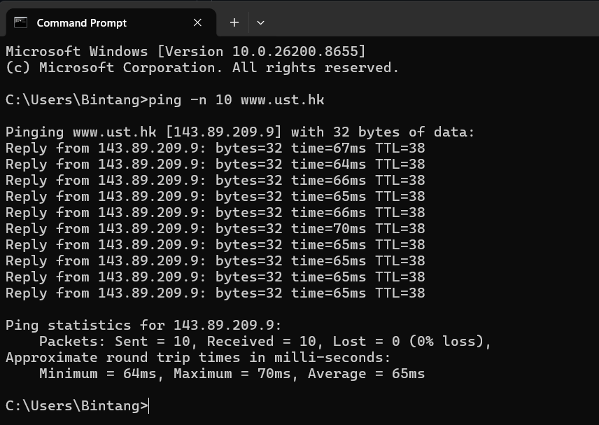
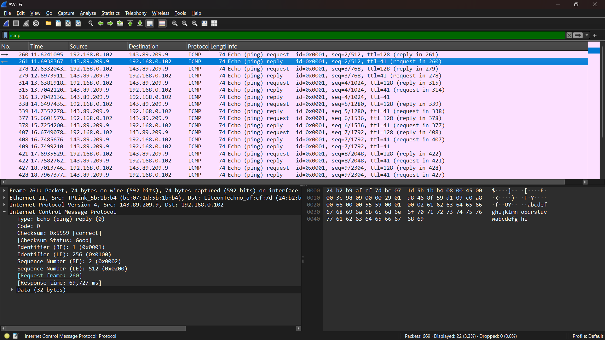
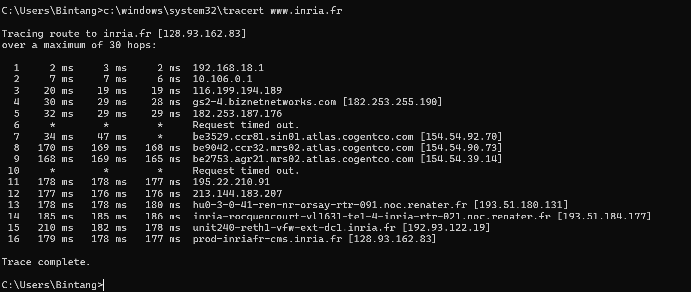
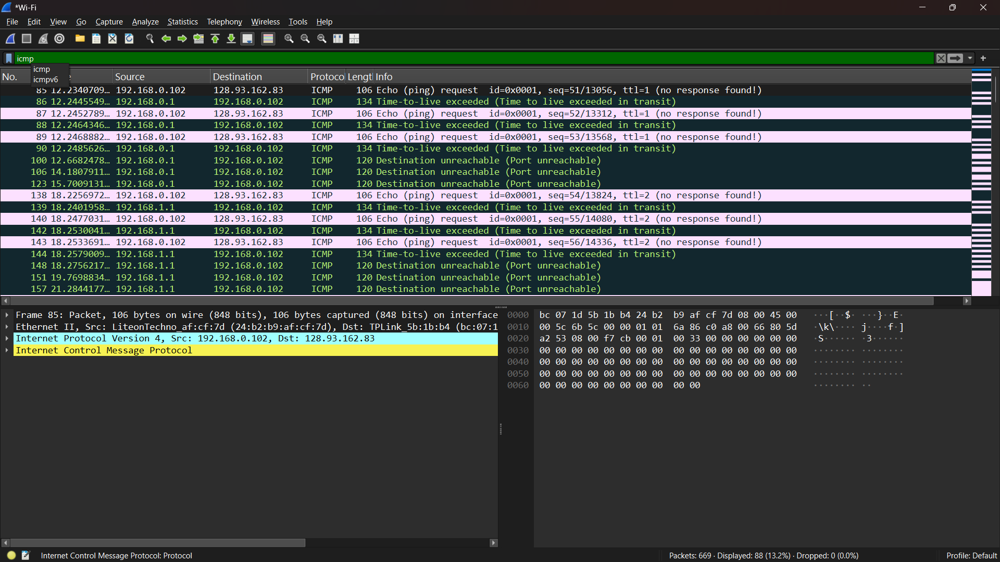
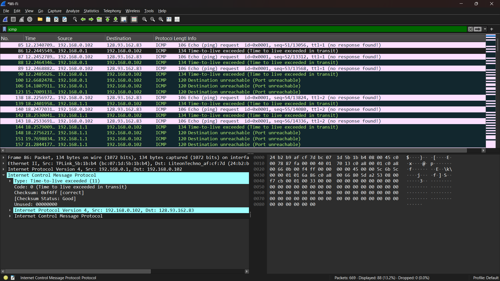

# Laporan Praktikum Jaringan Komputer IF-04-02
NAMA : Bagas Bintang Saputro
NIM  : 103072400078

## ICMP
Tujuan
- Mahasiswa dapat menginvestigasi cara kerja protokol ICMP menggunakan Wireshark
- Mahasiswa dapat membuat program ICMP Pinger

## ICMP dan PING
ping -n 10 www.ust.hk

ICMP ( Echo Ping Request )

ICMP ( Echo Ping Reply )

## ICMP dan Traceroute
c:\windows\system32\tracert www.inria.fr

ICMP after c:\windows\system32\tracert www.inria.fr in CMD

Detail Time-To-Live Exceeded
