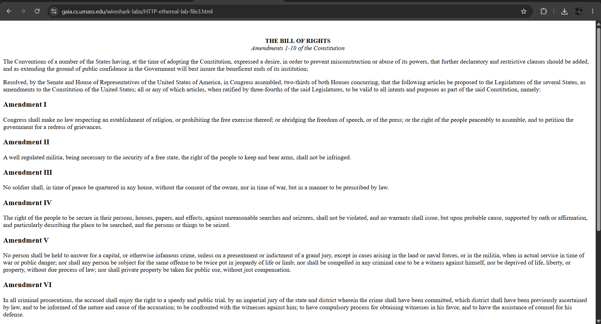
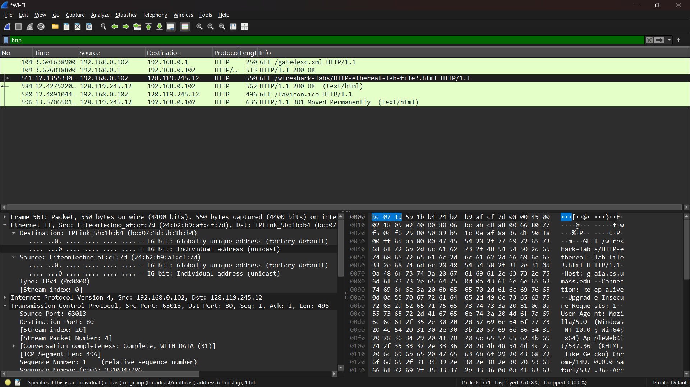
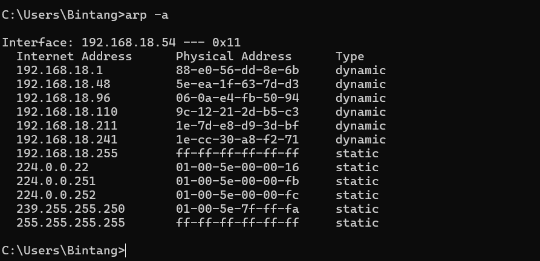
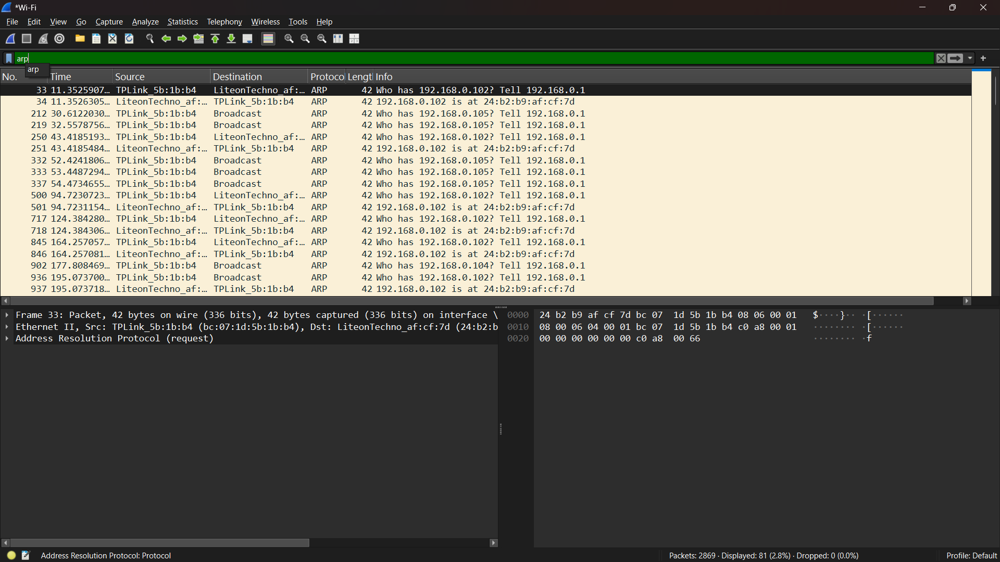

# Laporan Praktikum Jaringan Komputer IF-04-02
NAMA : Bagas Bintang Saputro
NIM  : 103072400078

## pengantar
saya akan menyelidiki protokol Ethernet dan protokol ARP. RFC 826 (ftp://ftp.rfc editor.org/in-notes/std/std37.txt) berisi detail mengerikan dari protokol ARP, yang digunakan oleh perangkat IP untuk menentukan alamat IP dari antarmuka jarak jauh yang alamat Ethernetnya diketahui.

## Menangkap dan menganalisis frame Ethernet
1. http://gaia.cs.umass.edu/wireshark-labs/HTTP-ethereal-lab-file3.html

2. HTTP after open gaia.cs.umass.edu/wireshark-labs/HTTP-ethereal-lab-file3.html

## Address Resolution Protocol
## Caching ARP
CMD arp -a

paket ARP
