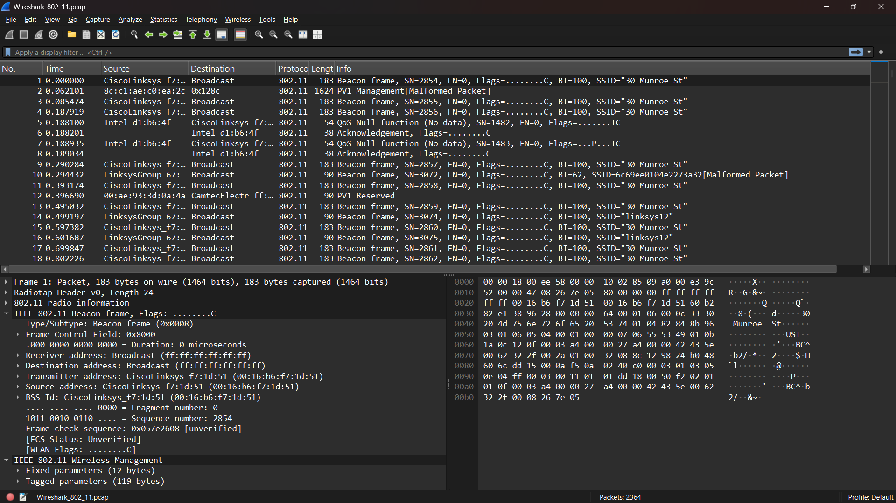
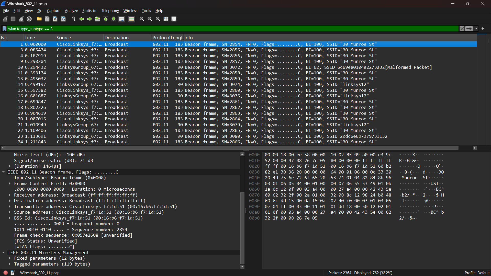
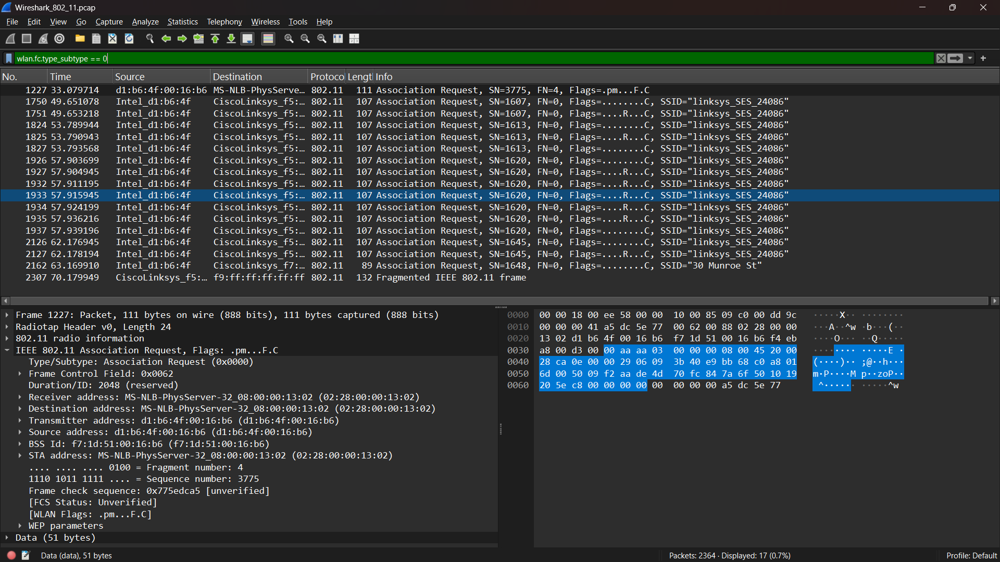
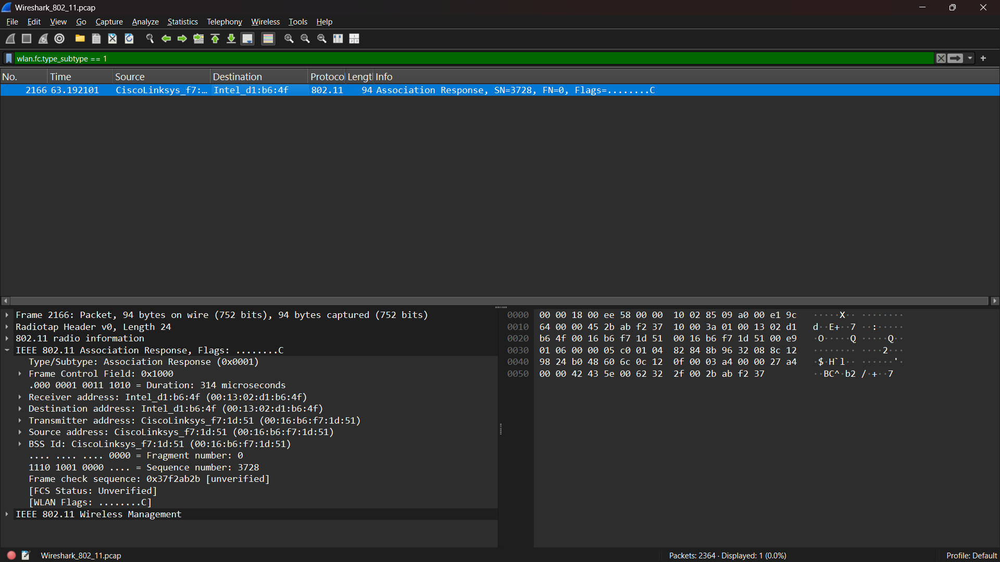

# Laporan Praktikum Jaringan Komputer IF-04-02
NAMA : Bagas Bintang Saputro
NIM  : 103072400078

## Modul 14 802.11 WiFi
Tujuan Praktikum :
1. Cara kerja protokol WiFi IEEE 802.11
2. Struktur frame 802.11
3. Beacon Frame
4. Data Transfer pada jaringan WiFi
5. Association dan Disassociation antara client dan Access Point (AP) menggunakan Wireshark.

## WireShark_802_11.pcap
Aktivitas host nirkabel yang diambil dalam file jejak adalah:
1. Host sudah diasosiasikan dengan 30 Munroe St AP saat pelacakan dimulai. Pada t = 24,82, host membuat permintaan HTTP ke http://gaia.cs.umass.edu/wiresharklabs/alice.txt. Alamat IP gaia.cs.umass.edu adalah 128.119.245.12.
2. Pada t=32.82, host membuat permintaan HTTP ke http://www.cs.umass.edu, dengan alamat IP 128.119.240.19. Pada t = 49,58, host memutuskan sambungan dari 30 Munroe St AP dan mencoba menyambung ke linksys_ses_24086. Ini bukan titik akses terbuka,dan host akhirnya tidak dapat terhubung ke AP ini.
3. Pada t=63.0 tuan rumah menyerah mencoba untuk mengasosiasikan dengan linksys_ses_24086 AP, dan mengasosiasikan lagi dengan titik akses 30 Munroe St.

## Beacon Frames
Fungsi : Mengumumkan keberadaan jaringan WiFi (SSID) dan memberikan informasi konfigurasi jaringan kepada perangkat di sekitar.

Analisis :
1. SSID = 30 Munroe St
2. BSSID = 00:16:b6:f7:1d:51
3. SOURCEADDRESS = 00:16:b6:f7:1d:51
4. DESTINATIONADDRESS = ff:ff:ff:ff:ff:ff
5. Beacon Interval = BI = 100 Beacon Interval = 100 TU (Time Unit)

## Data Transfer
Fungsi : Mengirimkan data pengguna seperti HTTP, TCP, DNS, dan aplikasi lainnya melalui jaringan WiFi.

## Association/Disassociation
Fungsi Assocation Request : Association Request adalah frame yang dikirim oleh client (station) kepada Access Point untuk meminta izin bergabung ke jaringan WiFi.

Fungsi Assocation Response : B alasan dari Access Point terhadap permintaan Association Request dari client.

Fungsi Disassociation : Disassociation digunakan untuk mengakhiri hubungan antara client (station) dan Access Point pada jaringan WiFi. Tidak ditemukan frame Disassociation pada file capture Wireshark_802_11.pcap yang digunakan dalam praktikum. Hal ini menunjukkan bahwa selama proses perekaman tidak terjadi pemutusan hubungan antara client dan Access Point, atau proses tersebut tidak ikut terekam dalam capture.